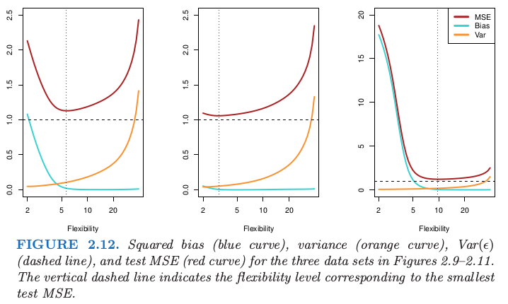

## Assessing Model Accuracy

### Measuring the Quality of Fit

In regression setting, the most commonly-used measure is the *mean square error*(MSE), given by
$$
MSE=\frac{1}{n}\sum_{i=1}^n{(y_i-\hat{f}(x_i))^2},
$$
where $\hat{f}(x_i)$ is the prediction given by $\hat{f}$ for $i$th observation. The MSE will be small if the predict responses are very close to the true responses.

But we don't really care about the *training MSE*, but *test MES*. If we have a large number of test observations, we could compute
$$
Ave(\hat{f}(x_0)-y_0)^2,
$$
where $(x_0,y_0)$ is previously unseen in training data.

However, if there is no test data, we can use *cross-validation* which is a method for estimating test MES using the training data.

There shows tree examples:

### The Bias-Variance Trade-off

The MSE can be decomposed into tree parts. That is,
$$
E(y_0-\hat{f}(x_0))^2 = Var(\hat{f}(x_0))+[Bias(\hat{f}(x_0))]^2+Var(\epsilon).
$$
This equation tells us in order to minimize the *expected test MSE*, we need to select a statistical learning method that simultaneously achieves *low variance* and *low bias*.

*Variance* refers to the amount by which $\hat{f}$ would change if we estimate it using a different training dataset. Since the training data are used to fit the statistical learning method, different training data set will result in different $\hat{f}$. An ideal estimate for $f$ should not vary too much between different training data.

*Bias* refers to the error that introduced by approximating a real-life problem, which may be extremely complicated, by a much simpler model. For instance, linear regression assumes that there is a linear relationship between $Y$ and $X_1, X_2, \dots, X_p$. It is unlikely that any real-life problem has such a linear relationship, and this assumption will undoubtedly cause some bias in estimating $f$. Generally, more flexible model result in less bias.

As a general rule, as we use more flexible methods, the variance will increase and bias will decrease.

Here gives a figure illustrate this equation for the examples showed in above section.

### The Classification Setting

The most common approach for quantifying the accuracy of estimate $\hat{f}$ is the training *error rate*. It is the proportion of mistakes that are made when we apply our estimate $\hat{f}$ to the training observations:
$$
\frac{1}{n} \sum_{i=1}^n{I}(y_i \ne \hat{y}_i).
$$
Here $\hat{y}_i$ is the predicted class label for the $i$th observation using $\hat{f}$. And $I(y_i \ne \hat{y}_i)$ is an *indicator variable* that equals 1 if $y_i \ne \hat{y}_i$ and 0 if $y_i = \hat{y}_i$.

The *test error* rate associated with a set of test observations of form $(x_0, y_0)$ is given by
$$
Ave(I(y_0 \ne \hat{y}_0)).
$$
A classifier is to assign each observation to the most likely class, given its predictor value. In other words, we can assign a test observation with predictor vector $x_0$ to the class $j$ for which
$$
Pr(Y=j|X=x_0)
$$
is largest.

This is a *conditional probability*, and it is a very simple classifier called the *Bayes classifier*. The Bayes classifier produces the lowest possible test error rate, called the *Bayes error rate*. In general, the overall Bayes error rate is given by
$$
1-E\bigg(\max \limits_{j}Pr(Y=j|X)\bigg),
$$

But in reality, we don't know the data distribution, the conditional distribution of $Y$ given $X$, and that make computing the Bayes classifier impossible. Many approaches attempt to estimate the conditional distribution of $Y$ given $X$, and then classify a given observation to the class with highest estimate probability. One such method is the *K-nearest neighbors* (KNN) classifier. It estimate the conditional probability for the class $j$ as the fraction of points in $N_0$ whose response value equals to $j$:
$$
Pr(Y=j|X=x_0)=\frac{1}{K}\sum_{i\in{N_0}}{I(y_i=j)}.
$$

The figures below show the relationship between Bayes classifier and KNN classifier.

In both of regression and classification setting, choosing the correct level of flexibility is critical to the success of any statistical learning method. This will be discussed in later chapter.
