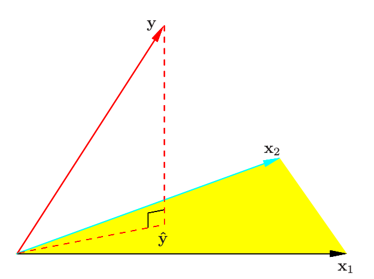
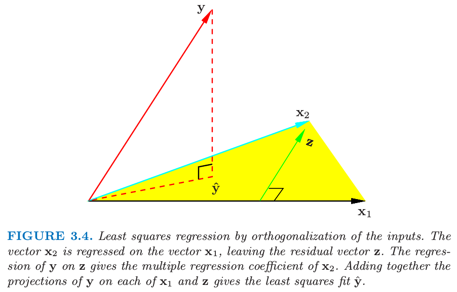

## Linear Regression Models and Least Squares

As introduced in Chapter 3, we have input vector $$X^T=(X_1,X_2,\dots,X_p)$$, and want to predict a real-valued output $$Y$$. The linear regression has the form as
$$
f(X)=\beta_0+\sum_{j=1}^pX_j\beta_j.
$$
The linear model assumes that the regression function $$E(Y|X)$$ is linear, or that the linear model is reasonable approximation. Here the $$\beta_j$$'s are unknown parameters or coefficients, and the variables $$X_j$$ can come from different sources:
+ quantitative inputs;
+ transformations of quantitative inputs, such as log, square-root, or square;
+ basis expansions, such as $$X_2=X_1^2, X_3=X_1^3$$, leading to a polynomial representation;
+ numeric or dummy coding of the level of qualitative inputs.
+ interaction between variables, such as $$X_3=X_1 \cdot X_2$$.

No mater the source of the $$X_j$$, the model is linear in the parameters.

Typically we have a set of training data $$(x_1, y_1), \dots, (x_N,y_N)$$ from which to estimate the parameters $$\beta$$. The most popular estimation method is *least squares*, in which we pick the coefficients $$\beta=(\beta_0, \beta_1, \dots, \beta_p)^T$$ to minimize the residual sum of squares
$$
\begin{align}
RSS(\beta) &= \sum_{i=1}^N(y_i-\hat{y}_i)^2 \\
&= \sum_{i=1}^N(y_i-f(x_i))^2 \\
&= \sum_{i=1}^N(y_i-\beta_0-\sum_{j=1}^p x_{ij}\beta_j)^2.
\end{align}
$$
From a statistical point of view, this criterion is reasonable if the training observations $$(x_i, y_i)$$ represent independent random draws from their population. Even if $$x_i$$'s were not drawn randomly, the criterion is still valid if the $$y_i$$'s are conditionally independent given the input $$x_i$$.

We can rewrite $$RSS(\beta)$$ as
$$
RSS(\beta)=(\mathbf{y}-\mathbf{X}\beta)^T(\mathbf{y}-\mathbf{X}\beta).
$$
Differentiating with respect to $$\beta$$ we obtain
$$
\frac{\partial{RSS}}{\partial{\beta}} = -2\mathbf{X}^T(\mathbf{y}-\mathbf{X}\beta)
$$
$$
\frac{\partial^2{RSS}}{\partial{\beta}\partial{\beta^T}} = 2\mathbf{X}^T\mathbf{X}.
$$
Assuming that $$\mathbf{X}$$ has full columns rank, and hence $$\mathbf{X}^T\mathbf{X}$$ is positive definite, we set the first derivative to zero
$$
\mathbf{X}^T(\mathbf{y}-\mathbf{X}\beta) = 0
$$
to obtain the unique solution
$$
\hat{\beta} = (\mathbf{X}^T \mathbf{X})^{-1} \mathbf{X}^T \mathbf{y}.
$$
The fitted values at training inputs are
$$
\hat{\mathbf{y}} = \mathbf{X}\hat{\beta} = \mathbf{X}(\mathbf{X}^T\mathbf{X})^{-1} \mathbf{X}^T \mathbf{y}
$$
The matrix $$\mathbf{H} = \mathbf{X}(\mathbf{X}^T\mathbf{X})^{-1}\mathbf{X}^T$$ is called the "hat" matrix.

We can consider the least squares estimate in a different way showed as below:

We denote the column vectors of $$\mathbf{X}$$ by $$\mathbf{x}_1, \mathbf{x}_2, \dots, \mathbf{x}_p$$, with $$\mathbf{x}_0 \equiv 1$$. We denote $$e = \mathbf{y}-\hat{\mathbf{y}}$$. And we can find $$RSS = \| \mathbf{y}-\mathbf{X}\beta \|^2$$, since $$RSS = \sum_{i=1}^N e_i$$. We minimize $$RSS(\beta)$$ by choosing $$\hat{\beta}$$ so that $$ \mathbf{y} - \hat{\mathbf{y}}$$ is orthogonal to this subspace. The matrix $$\mathbf{H}$$ is also called projection matrix.

It might happen that the columns of $$\mathbf{X}$$ are not linearly independent, so that $$\mathbf{X}$$ is not of full rank. In this situation, the features are typically reduced by filtering or else the fitting is controlled by regularization (Section 5.2.3 and Chapter 18)

Up to now we have made minimal assumptions about the true distribution of the data. In order to pin down the sampling properties of $$\hat{\beta}$$, we now assume the observations $$y_i$$ are uncorrelated and have constant variance $$\sigma^2$$, and that $$x_i$$ are fixed. The variance-covariance matrix of the least square parameter estimates is
$$
\begin{align}
Var(\hat{\beta}) &= E[(\hat{\beta}-\beta)(\hat{\beta}-\beta)^T] \\
&= E[(X^TX)^{-1}X^T \varepsilon][(X^TX)^{-1}X^T \varepsilon]^T \\
&= (X^T X)^{-1} X^T X (X^T X)^{-1} E(\varepsilon \varepsilon^T) \\
&= (X^TX)^{-1}E(\varepsilon \varepsilon^T)\\
&= (X^TX)^{-1} \sigma^2
\end{align}
$$
Typically one estimates the variance $$\sigma^2$$ by
$$
\hat{\sigma}^2 = \frac{1}{N-p-1} \sum_{i=1}^N(y_i-\hat{y}_i)^2.
$$
The $$N-p-1$$ rather than $$N$$ makes $$\hat{\sigma}^2$$ an unbiased estimate of $$\sigma^2$$: $$E(\hat{\sigma}^2) = \sigma^2$$.

Usually, we need to test for the significance of groups of coefficients simultaneously. For example, to test if a categorical variable with $$k$$ levels can be excluded from a model, we need to test whether the coefficients of the dummy variables used to represent the levels can all be set to zero. Here we use the $$F$$ statistic,
$$
F = \frac{(RSS_0-RSS_1)/(p_1-p_0)}{RSS_1/(N-p-1)},
$$
where $$RSS_1$$ is the residual sum-of-squares for the least squares fit of the bigger model with $$p_1 +1$$ parameters, and $$RSS_0$$ the same for the nested smaller model with $$p_0 + 1$$ parameters, having $$p_1 − p_0$$ parameters constrained to be zero.

### The Gauss-Markov Theorem

One of the most famous results in statistics asserts that the least squares estimates of the parameters $$\beta$$ have the smallest variance among all linear unbiased estimates. We focus on estimates of any linear combination of the parameters $$\theta = \alpha^T \beta$$; for example, predictions $$f(x_0) = x_0^T\beta$$ are of this form. The least squares estimate of $$\alpha^T \beta$$ is
$$
\hat{\theta} = \alpha^T(\mathbf{X}^T\mathbf{X})^{-1} \mathbf{X}^T \mathbf{y}
$$

Considering X to be fixed, this is a linear function $$\mathbf{c}_0^T \mathbf{y}$$ of the response vector $$\mathbf{y}$$. If we assume the linear model is correct, $$\alpha^T \hat{\beta}$$ is unbiased since
$$
\begin{align}
E(\alpha^T\hat{\beta}) &= E(\alpha^T(\mathbf{X}^T\mathbf{X})^{-1} \mathbf{X}^T \mathbf{y})\\
&=\alpha^T(\mathbf{X}^T\mathbf{X})^{-1} \mathbf{X}^T \mathbf{X} \beta \\
&=\alpha^T \beta.
\end{align}
$$
The Gauss-Markov theorem states that if we have any other linear estimator $$\tilde{\theta}=\mathbf{c}^T \mathbf{y}$$ that is unbiased for $$\alpha^T\beta$$, that is, $$E(\mathbf{c}^T\mathbf{y}) = \alpha^T\beta$$, then
$$
Var(\alpha^T\beta) \le Var(\mathbf{c}^T\mathbf{y}).
$$
Consider the mean squared error of an estimator $$\tilde{\theta}$$ in estimating $$\theta$$:
$$
\begin{align}
MSE(\tilde{\theta}) &= E(\tilde{\theta}-\theta)^2 \\
&= E(\tilde{\theta}^2-2\tilde{\theta}\theta + \theta^2) \\
&= E(\tilde{\theta}^2)-(E(\tilde{\theta}))^2+(E(\tilde{\theta}))^2-2E(\tilde{\theta})\theta + \theta^2 \\
&= Var(\tilde{\theta}) + (E(\tilde{\theta})-\theta)^2
\end{align}
$$
The first term is the variance, while the second term is the squared bias. The Gauss-Markov theorem implies that the least squares estimator has the smallest mean squared error of all linear estimators with no bias.

### Multiple Regression from Simple Univariate Regression

The linear model with $$p > 1$$ inputs is called the *multiple linear regression model*. The least squares estimates for this model are best understood in terms of the estimates for the *univariate*$$(p=1)$$ linear model, as we indicate in this section.

Suppose first that we have a univariate model with no intercept, that is,
$$
Y=X\beta+\varepsilon.
$$
The least squares estimate and residuals are
$$
\hat{\beta} = \frac{\sum_1^N x_i y_i}{\sum_1^N x_i^2}, \\
r_i = y_i-x_i\hat{\beta}.
$$
In convenient vector notation, we let $$\mathbf{y}=(y_1,\dots,y_N)^T, \mathbf{x}=(x_1,\dots,x_N)^T$$ are define
$$
\begin{align}
\langle \mathbf{x},\mathbf{y} \rangle &= \sum_{i=1}^N x_i y_i \\
&= \mathbf{x}^T\mathbf{y},
\end{align}
$$
the inner product between $$\mathbf{x}$$ and $$\mathbf{y}$$. Then we can write
$$
\hat{\beta}=\frac{\langle \mathbf{x},\mathbf{y} \rangle}{\langle \mathbf{x},\mathbf{x} \rangle}, \\
\mathbf{r} = \mathbf{y} - \mathbf{x}\hat{\beta}.
$$
Suppose that the inputs $$\mathbf{x}_1, \mathbf{x}_2, \dots, \mathbf{x}_p$$ are orthogonal; that is $$\langle \mathbf{x}_i, \mathbf{x}_k \rangle$$ for all $$i \ne k$$. It is easy to check that the multiple least squares estimates $$\hat{\beta_j}$$ are equal to $$\langle \mathbf{x_j},\mathbf{y} \rangle/\langle \mathbf{x_j},\mathbf{x_j} \rangle$$. In other words, when the inputs are orthogonal, they have no effect on each other's parameter estimates in the model.

Suppose that we have an intercept and single input $$\mathbf{x}$$. Then the least squares coefficient of $$\mathbf{x}$$ has the form
$$
\hat{\beta}_1 = \frac{\langle \mathbf{x}-\bar{x}\mathbf{1}, \mathbf{y} \rangle}{\langle \mathbf{x}-\bar{x}\mathbf{1}, \mathbf{x}-\bar{x}\mathbf{1} \rangle},
$$
where $$\bar{x}=\sum_i x_i/N$$, and $$\mathbf{1}=\mathbf{x}_0$$, the vector of $$N$$ ones. We can view the estimate $$\hat{\beta}$$ as the result of two applications of the simple regression. The steps are:
1. regress $$\mathbf{x}$$ on $$\mathbf{1}$$ to produce the residual $$\mathbf{z}=\mathbf{x} - \bar{x}\mathbf{1}$$;
2. regress $$\mathbf{y}$$ on the residual $$\mathbf{z}$$ to give the coefficient $$\hat{\beta}_1$$.

In this procedure, "regress $$\mathbf{b}$$ on $$\mathbf{a}$$" means a simple univariate regression of $$\mathbf{b}$$ on $$\mathbf{a}$$ with no intercept, producing coefficient $$\hat{\gamma} = \langle \mathbf{a}, \mathbf{b} \rangle / \langle \mathbf{a}, \mathbf{a} \rangle$$ and residual vector $$\mathbf{b} − \hat{\gamma}\mathbf{a}$$. We say that $$\mathbf{b}$$ is adjusted for $$\mathbf{a}$$, or is "orthogonalized" with respect to $$\mathbf{a}$$.

This procedure can be shown as below:

The algorithm is
> 1. Initialize $$\mathbf{z}_0=\mathbf{x}_0=\mathbf{1}$$.
> 2. For $$j=1,2,\dots,p$$
> Regress $$\mathbf{x}_j$$ on $$\mathbf{z}_0, \mathbf{z}_1,\dots,\mathbf{z}_{j-1}$$ to produce coefficients $$\hat{\gamma}_{\ell j} = \langle \mathbf{z}_\ell, x_j \rangle / \langle \mathbf{z}_\ell, \mathbf{z}_\ell \rangle, \ell = 0, \dots, j-1$$ and residual vector $$\mathbf{z}_j=\mathbf{x}_j-\sum_{k=0}^{j-1}\hat{\gamma}_{kj}\mathbf{z}_k$$.
> 3. Regress $$\mathbf{y}$$ on the residual $$\mathbf{z}_p$$ to give the estimate $$\hat{\beta}_p$$.

The result of this algorithm is
$$
\hat{\beta}_p = \frac{\langle \mathbf{z}_p \mathbf{y} \rangle}{\langle \mathbf{z}_p \mathbf{z}_p \rangle}.
$$
And we can get
$$
Var(\hat{\beta}_p)=\frac{\sigma^2}{\langle \mathbf{z}_p \mathbf{z}_p \rangle} = \frac{\sigma^2}{\| \mathbf{z}_p \|^2},
$$
which means the precision of $$\hat{\beta}$$ depends on the length of the residual vector $$\mathbf{z}_p$$; this represents how much of $$\mathbf{x}_p$$ is unexplained by other $$\mathbf{x}_k$$'s.

We can represent the algorithm step2 in matrix form
$$
\mathbf{X}=\mathbf{Z\Gamma},
$$
where $$\textbf{Z}$$ has as columns the $$\mathbf{z}_j(in order)$$, and $$\mathbf{\Gamma}$$ is the upper triangular matrix with entries $$\hat{\gamma}_{kj}$$. Introducing the diagonal matrix $$\mathbf{D}$$ with $$j$$th diagonal entry $$D_{jj}=\|\mathbf{z}_j\|$$, we get
$$
\mathbf{X}=\mathbf{ZD}^{-1}\mathbf{D\Gamma}=\mathbf{QR},
$$
the so-called *QR decomposition* of $$\mathbf{X}$$. Here $$\mathbf{Q}$$ is an $$N\times(p+1)$$ orthogonal matrix, $$\mathbf{Q}^T\mathbf{Q}=\mathbf{I}$$, and $$\mathbf{R}$$ is a $$(p+1)\times(p+1)$$ upper triangular matrix.

The $$\mathbf{QR}$$ decomposition represents a convenient orthogonal basis for the column space of $$\mathbf{X}$$. It is easy to see, for example, that the least squares solution is given by
$$
\hat{\beta}=\mathbf{R}^{-1} \mathbf{Q}^T \mathbf{y}\\
\hat{y}=\mathbf{QQ}^T\mathbf{y}.
$$

### Multiple Outputs

Suppose we have multiple outputs $$Y_1, Y_2, \dots, Y_K$$ that we wish to predict from our inputs $$X_0, X_1, \dots, X_p$$. We assume a linear model for each output
$$
Y_k=\beta_{0k}+\sum_{j=1}^p X_j\beta_{jk} + \varepsilon_k = f_k(X)+\varepsilon_k.
$$
With $$N$$ training cases we can write the model in matrix notation
$$
\mathbf{Y}=\mathbf{XB}+\mathbf{E}.
$$
Here $$\mathbf{Y}$$ is the $$N \times K$$ matrix, with $$ik$$ entry $$y_{ik}$$, $$\mathbf{X}$$ is the $$N \times (p+1)$$ input matrix, $$\mathbf{B}$$ is the $$(p+1) \times K$$ matrix of parameters and $$\mathbf{E}$$ is the $$N \times K$$ matrix of errors. A straightforward generalization of the univariate loss function is
$$
\begin{align}
RSS(\mathbf{B}) &= \sum_{k=1}^K \sum_{i=1}^N(y_{ik}-f_k(x_i))^2 \\
&= tr[(\mathbf{Y-\mathbf{XB}})^T(\mathbf{Y-\mathbf{XB}})].
\end{align}
$$
The least squares estimates have exactly the same form as before
$$
\hat{\mathbf{B}} = (\mathbf{X}^T \mathbf{X})^{-1} \mathbf{X}^T \mathbf{Y}.
$$
If the errors $$\varepsilon = (\varepsilon_1, \dots, \varepsilon_K)$$ are correlated, then it might seem appropriate to modify $$RSS(\mathbf{B})$$ into
$$
RSS(\mathbf{B};\mathbf{\Sigma}) = \sum_{i=1}^N(y_i-f(x_i))^T\mathbf{\Sigma}^{-1}(y_i-f(x_i))
$$
suppose $$Cov(\varepsilon) = \mathbf{\Sigma}$$. Here $$f(x)$$ is the vector function $$(f_1(x), \dots , f_K(x))$$, and $$y_i$$ the vector of $$K$$ responses for observation $$i$$.
