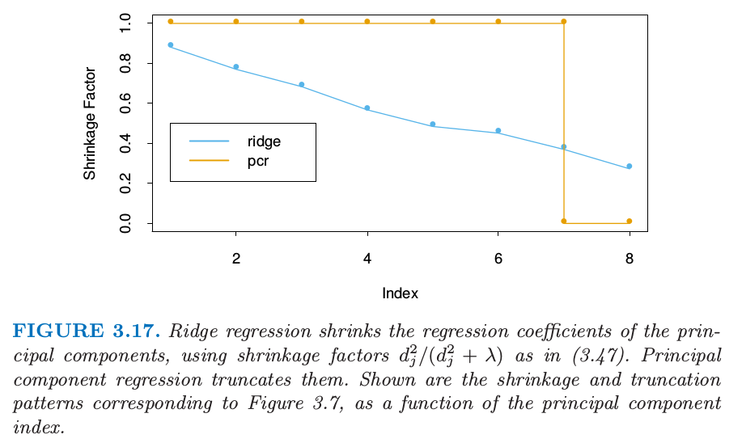
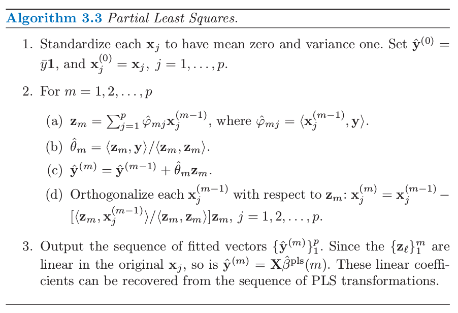

In many situations we have a large number of inputs, often very correlated. The methods in this section produce a small number of linear combinations $$Z_m, m=1,\dots,M$$ of the original inputs $$X_j$$, and the $$Z_m$$ are then used in place of $$X_j$$ as inputs in the regression.

### Principal Components Regression

Principal component regression forms the derived input columns $$\mathbf{z}_m=\mathbf{X}v_m$$, and then regresses $$\mathbf{y}$$ on $$\mathbf{z}_1,\mathbf{z}_2,\dots,\mathbf{z}_M$$ for some $$M \le p$$. Since the $$\mathbf{z}_m$$ are orthogonal, this regression is just a sum of univariate regressions:
$$
\hat{\mathbf{y}}_{(M)}^{pcr}=\bar{y}\mathbf{1} + \sum_{m=1}^M \hat{\theta}_m \mathbf{z}_m,
$$
where $$\hat{\theta}_m=\langle \mathbf{z}_m, \mathbf{y} \rangle / \langle \mathbf{z}_m, \mathbf{z}_m \rangle$$. So
$$
\begin{align}
\hat{\mathbf{y}}_{(M)}^{pcr} &= \bar{y}\mathbf{1} + \sum_{m=1}^M \hat{\theta}_m \mathbf{z}_m \\
&= \bar{y} \mathbf{1} + \mathbf{X}\sum_{m-1}^M \hat{\theta}_m v_m,
\end{align}
$$
then we can find out that
$$
\hat{\beta}^{pcr}(M)=\sum_{m=1}^M \hat{\theta}_m v_m.
$$

As with ridge regression, principle components depends on the scaling of the inputs, so typically we first standardize them. Note that if $$M=p$$ we would just get back the usual least squares estimates, since the columns of $$\mathbf{Z}=\mathbf{UD}$$ span the column space of $$X$$. For $$M < p$$ we get a reduced regression. We see that principle regression is very similar to ridge regression: both operate via the principal components of the input matrix. Ridge regression shrinks the coefficients of the principal components, shrinking more depending on the size of the corresponding eigenvalue; principal components regression discard the $$p-M$$ smallest eigenvalue components. Figure 3.17 illustrates this.

### Partial Least Squares

This technique also constructs a set of linear combination of the input for regression, but unlike principal components regression it uses $$\mathbf{y}$$ (in addition to $$\mathbf{X}$$) for this construction. PLS begins by computing $$\varphi_{1j} = \langle \mathbf{x}_j, \mathbf{y} \rangle$$ for each $$j$$. From this we construct the derived input $$\mathbf{z}_1 = \sum_j \hat{\varphi}_{1j}\mathbf{x}_j$$, which is the first partial least squares direction. The procedure is described fully in algorithm 3.3

In the prostate cancer example, cross-validation chose $$M=2$$ PLS directions in Figure 3.7. This produced the model given in the rightmost column of Table 3.3.

Partial least squares uses the response $$\mathbf{y}$$ to construct its directions, its solution path is a nonlinear function of $$\mathbf{y}$$. It can be shown that partial least squares seeks directions that have high variance and have high correlations with the response, in contrast to principal components regression which keys only on high variance. In particular, the $$m$$th principal component direction $$v_m$$ solves:
$$
max_{\alpha}Var(\mathbf{X}\alpha) \\
\textrm{subject to }\| \alpha \|=1, \alpha^T \mathbf{S} v_{\ell}=0, \ell=1,\dots, m-1,
$$
where $$\mathbf{S}$$ is the sample covariance matrix of the $$\mathbf{x}_j$$. The condition $$\alpha^T \mathbf{S} v_{\ell}=0$$ ensures that $$\mathbf{z}_m=\mathbf{X}\alpha$$ is uncorelated with all the previous linear combinations $$\mathbf{z}_{\ell}=\mathbf{X}v_{\ell}$$. The $$m$$th PLS direction $$\hat{\varphi}_m$$ solves:
$$
max_{\alpha}Corr^2(\mathbf{y}, \mathbf{X}\alpha)Var(\mathbf{X}\alpha) \\
\textrm{subject to } \|\alpha\|=1, \alpha^T\mathbf{S} \hat{\varphi}_{\ell}=0, \ell=1, \dots, m-1.
$$
