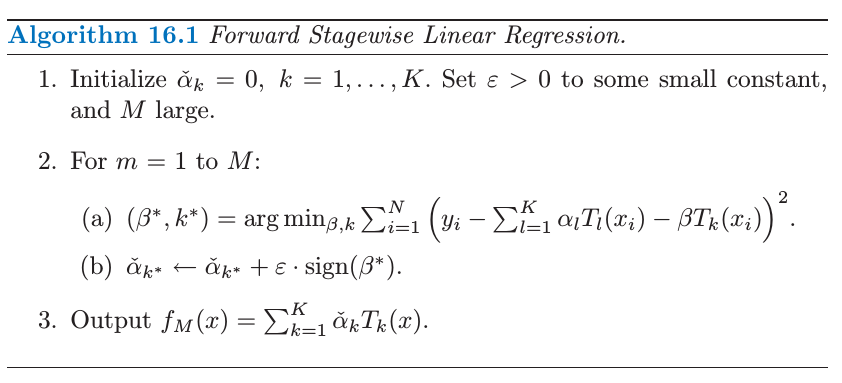

### Incremental Forward Stagewise Regression

The incremental forward stagewise regression algorithm is showed as below.

Meanwhile, the linear-version of the forward stagewise boosting algorithm is like this:

The incremental forward stagewise regression generates a coefficient profile by repeatedly updating (by a small amount $$\epsilon$$) the coefficients of the variable most correlated with the current residuals. Figure 3.19 (left panel) shows the progress of the algorithm on the prostate data with step size $$\epsilon=0.01$$. If $$\delta_j=\langle \mathbf{x}_j, \mathbf{r} \rangle$$, then this is exactly the usual forward stagewise procedure (FS) outlined in Section 3.3.3 (page 60).

Here we are mainly interested in small value of $$\epsilon$$. Letting $$\epsilon \rightarrow 0$$ gives the right panel of Figure 3.19, which in this case is identical of the lasso path in Figure 3.10. We call this limiting procedure *infinitesimal forward stagewise regression* or $$\textrm{FS}_0$$.
