## Shrinkage Methods

By retaining a subset of the predictors and discarding the rest, subset selection produces a model that is interpretable and has possibly lower prediction error than the full model. However, because it is a discrete process—variables are either retained or discarded—it often exhibits high variance, and so doesn't reduce the prediction error of the full model. Shrinkage methods are more continuous, and don't suffer as much from high variability.

### Ridge Regression
Ridge regression shrinks the regression coefficients by imposing a penalty on their size. The ridge coefficients minimize a penalized residual sum of squares,
$$
\hat{\beta}^{ridge} = \mathop{argmin}_{\beta} \Big\{ \sum_{i=1}^N(y_i-\beta_0-\sum_{j=1}^p x_{ij}\beta_j)^2 + \lambda \sum_{j=1}^p \beta_j^2 \Big \}.
$$

Here $$\lambda \ge 0$$ is a complexity parameter that controls the amount of shrinkage: the larger the value of $$\lambda$$, the greater the amount of shrinkage. The coefficients are shrunk toward zero (and each other).

An equivalent way to write the ridge problem is
$$
\hat{\beta}^{ridge}=\mathop{argmin}_{\beta} \sum_{i=1}^N \Big (y_i - \beta_0- \sum_{j=1}^p x_{ij}\beta_j \Big )^2, \\
\textrm{subject to} \sum_{j=1}^p \beta_j^2 \le t,
$$
which makes explicit the size constraint on the parameters.

The ridge solutions are not equivariant under scaling of the inputs, and so one normally standardizes the inputs before solving.

In addition, notice that the intercept $$\beta_0$$ has been left out of the penalty term. Penalization of the intercept would make the procedure depend on the origin chosen for $$Y$$; that is, adding a constant $$c$$ to each of the targets $$y_i$$ would not simply result in a shift of the predictions by the same amount $$c$$. We estimate $$\beta_0$$ by $$\bar{y} = \frac{1}{N} \sum_1^N y_i$$. The remaining coefficients get estimated by a ridge regression without intercept, using the centered $$x_{ij}$$.

We can get
$$
RSS(\lambda) = (\mathbf{y}-\mathbf{X}\beta)^T (\mathbf{y}-\mathbf{X}\beta) + \lambda\beta^T\beta, \\
\begin{align}
\frac{\partial{RSS}}{\partial{\beta}} &= \frac{\partial(\mathbf{y}^T\mathbf{y}-\beta^T\mathbf{X}^T\mathbf{y}-\mathbf{y}^T\mathbf{X}\beta+\beta^T\mathbf{X}^T\mathbf{X}\beta+\beta^T \lambda\mathbf{I}\beta)}{\partial{\beta}} \\
&=-2\mathbf{X}^T\mathbf{y}+2\mathbf{X}^T\mathbf{X}\beta+2\lambda\mathbf{I}\beta.
\end{align}
$$
And
$$
\hat{\beta}^{ridge}=(\mathbf{X}^T\mathbf{X}+\lambda\mathbf{I})^{-1} \mathbf{X}^T\mathbf{y}
$$
In the case of orthonormal inputs, the ridge estimates are just a scaled version of the least squares estimates, that is, $$\hat{\beta}^{ridge} = \hat{\beta}/(1 + \lambda)$$.

Ridge regression can also be derived as the mean or mode of a posterior distribution, with a suitably chosen prior distribution.

The *singular value decomposition* (SVD) of the centered input matrix $$\mathbf{X}$$ gives us some additional insight into the nature of ridge regression. The SVD of $$N \times p$$ matrix $$\mathbf{X}$$ has the form
$$
\mathbf{X} = \mathbf{UDV}^T.
$$
And we can find that $$\mathbf{UU}^T=\mathbf{I}$$ and $$\mathbf{VV}^T=\mathbf{I}$$, $$\mathbf{D}^T=\mathbf{D}$$, $$\mathbf{U}=\mathbf{U}^{-T}$$, $$\mathbf{V}=\mathbf{V}^{-T}$$, $$\mathbf{X}^T \mathbf{X}=\mathbf{V}\mathbf{D}^2\mathbf{V}^T$$.

Using the singular value decomposition we can write the least squares fitted vector as
$$
\begin{align}
\mathbf{X}\hat{\beta}^{ls} &= \mathbf{X}(\mathbf{X}^T\mathbf{X})^{-1}\mathbf{X}^T\mathbf{y} \\
&= \mathbf{UDV}^T(\mathbf{V}\mathbf{D}^2\mathbf{V}^T)^{-1}\mathbf{VD}^T\mathbf{U}^T\mathbf{y} \\
&= \mathbf{UDV}^T\mathbf{V}^{-T}\mathbf{D}^{-2}\mathbf{V}^{-1}\mathbf{VD}^T\mathbf{U}^T\mathbf{y} \\
&= \mathbf{U}\mathbf{U}^T\mathbf{y},
\end{align}
$$
after some simplification.
Well, in fact, $$\mathbf{U}\mathbf{U}^T = \mathbf{I}$$. We should also notice that, the $$\mathbf{Q}$$ and $$\mathbf{U}$$ are totally different orthogonal bases for the columns space of $$\mathbf{X}$$.

Now the ridge solution are
$$
\begin{align}
\mathbf{X}\hat{\beta}^{ridge} &= \mathbf{X}(\mathbf{X}^T\mathbf{X}+\lambda\mathbf{I})^{-1} \mathbf{X}^T\mathbf{y} \\
&= \mathbf{UDV}^T(\mathbf{V}\mathbf{D}^2\mathbf{V}^T+\lambda\mathbf{VV}^T)^{-1}\mathbf{VDU}^T\mathbf{y} \\
&= \mathbf{UDV}^T(\mathbf{V}(\mathbf{D}^2+\lambda\mathbf{I})\mathbf{V}^T)^{-1}\mathbf{VDU}^T\mathbf{y} \\
&= \mathbf{UD}(\mathbf{D}^2+\lambda\mathbf{I})^{-1}\mathbf{DU}^T\mathbf{y} \\
&= \sum_{j=1}^p \mathbf{u}_j \frac{d_j^2}{d_j^2+\lambda}\mathbf{u}_j^T\mathbf{y},
\end{align}
$$
where $$\mathbf{u_j}$$ are the columns of $$\mathbf{U}$$. Like linear regression, ridge regression computes the coordinates of $$\mathbf{y}$$ with respect to the orthonormal basis $$\mathbf{U}$$. It then shrinks these coordinates by the factors $$\frac{d_j^2}{d^2_j+\lambda}$$. This means that a greater amount of shrinkage is applied to the coordinates of basis vectors with smaller $$d^2_j$$.

What does a small value of $$d^2_j$$ mean? The SVD of the centered matrix $$\mathbf{X}$$ is another way of expressing the principal components of the variables in $$\mathbf{X}$$. The sample covariance matrix is given by $$\mathbf{S} = \mathbf{X}^T\mathbf{X}/N$$, which is the *eigen decomposition* of $$\mathbf{X}^T\mathbf{X}$$(and of $$\mathbf{S}$$, up to a factor $$N$$). The eigenvectors $$v_j$$ (columns of $$\mathbf{V}$$) are also called the *principal components* (or Karhunen–Loeve) directions of $$\mathbf{X}$$. The first principal component direction $$v_1$$ has the property that $$\mathbf{z}_1 = \mathbf{X}v_1$$ has the largest sample variance amongst all normalized linear combinations of the columns of $$\mathbf{X}$$. This sample variance is easily seen to be
$$
Var(\mathbf{z}_1) = Var(\mathbf{X}v_1) = \frac{d_1^2}{N}
$$
and in fact $$\mathbf{z}_1 = \mathbf{X}v_1 = \mathbf{u}_1 d_1$$. The derived variable $$\mathbf{z}_1$$ is called the first principal component of $$\mathbf{X}$$, and hence $$\mathbf{u}_1$$ is the normalized first principal component.[^1]

The definition of the effective degrees of freedom $$df(\lambda)$$ in ridge regression is given by
$$
\begin{align}
df(\lambda) &= tr[\mathbf{X}(\mathbf{X}^T\mathbf{X}+\lambda \mathbf{I})^{-1}\mathbf{X}^T] \\
&= tr[\mathbf{UD}(\mathbf{D}^2+\lambda\mathbf{I})^{-1}\mathbf{DU}^T] \\
&= \sum_{j=1}^p\frac{d_j^2}{d_j^2+\lambda} \\
&= tr(\mathbf{H}_{\lambda})
\end{align}
$$

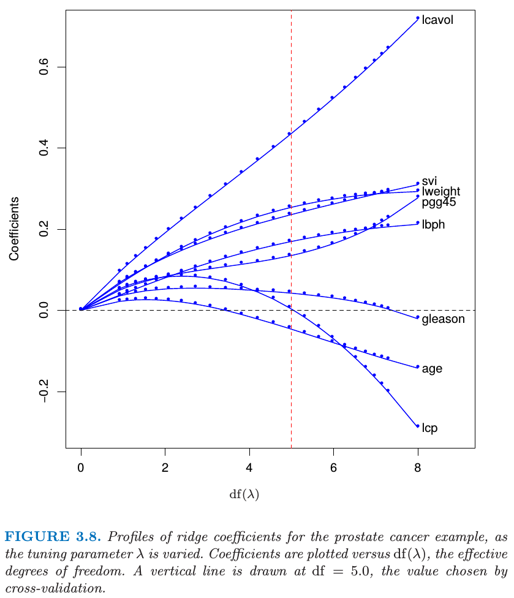

### The Lasso

The lasso is a shrinkage method like ridge, with subtle but important differences. The lasso estimate is defined by
$$
\hat{\beta}^{lasso} = \mathop{argmin}_{\beta} \sum_{i=1}^N \Big(y_i-\beta_0-\sum_{j=1}^p x_{ij}\beta_j \Big)^2 \\
\textrm{subject to} \sum_{j=1}^p |\beta_j| \le t.
$$
Just as in ridge regression, we can re-parametrize the constant $$\beta_0$$ by standardizing the predictors; the solution for $$\hat{\beta}_0$$ is $$\bar{y}$$, and thereafter we fit a model without an intercept.

We can also write the lasso problem in the equivalent *Lagrangian form*
$$
\hat{\beta}^{lasso}=\mathop{argmin}_{\beta} \Bigg\{\sum_{i=1}^N(y_i-\beta_0-\sum_{j=1}^p x_{ij}\beta_j)^2 + \lambda \sum_{j=1}^p|\beta_j| \Bigg\}
$$
Notice the similarity of ridge regression. The $$L_2$$ ridge penalty $$\sum_1^p \beta_j^2$$ is replaced by the $$L_1$$ lasso penalty $$\sum_1^p |\beta_j|$$. This latter constraint makes the solutions nonlinear in the $$y_i$$, and there is no closed form expression as in ridge regression.If $$t$$ is chosen larger than $$t_0 = \sum_1^p | \hat{\beta}_j |$$ (where $$\hat{\beta}_j = \hat{\beta}^{ls}_j$$, the least squares estimates), then the lasso estimates are the $$\hat{\beta}_j$$'s. On the other hand, for $$t = t_0 /2$$ say, then the least squares coefficients are shrunk by about 50% on average. Like the subset size in variable subset selection, or the penalty parameter in ridge regression, $$t$$ should be adaptively chosen to minimize an estimate of expected prediction error.

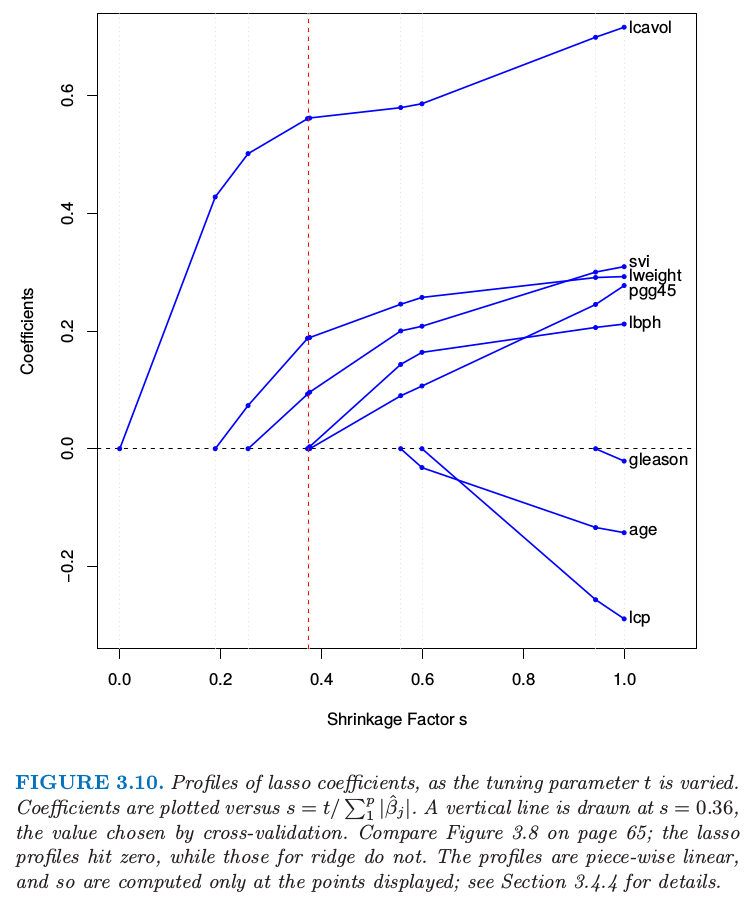

### Discussion: Subset Selection, Ridge Regression and the Lasso

In the case of an orthonormal input matrix X the three procedures have explicit solutions. Each method applies a simple transformation to the least squares estimate $$\hat{\beta}_j$$ , as detailed in Table 3.4.

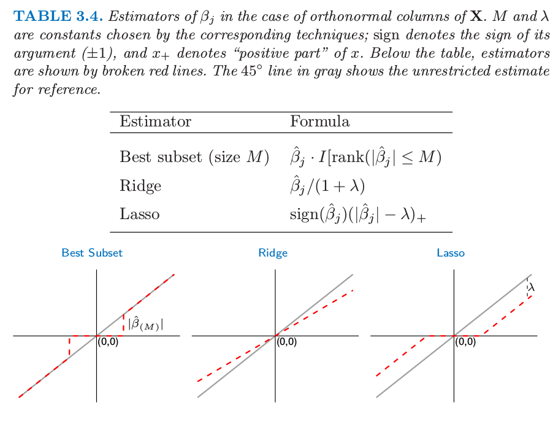

Ridge regression does a proportional shrinkage. Lasso translates each coefficient by a constant factor $$\lambda$$, truncating at zero. This is called "soft thresholding", and is used in the context of wavelet-based smoothing. Best-subset selection drops all variables with coefficients smaller than the $$M$$th largest; this is a form of "hard-thresholding".

Back to the nonorthogonal case; some pictures help understand their relationship. Figure 3.11 depicts the lasso (left) and ridge regression (right) when there are only two parameters. The residual sum of squares has elliptical contours, centered at the full least squares estimate. The constraint region for ridge regression is the disk $$\beta_1^2 + \beta_2^2 \le t$$, while that for lasso is the diamond $$|\beta_1 | + |\beta_2 | \le t$$. Both methods find the first point where the elliptical contours hit the constraint region. Unlike the disk, the diamond has corners; if the solution occurs at a corner, then it has one parameter $$\beta_j $$ equal to zero. When $$p > 2$$, the diamond becomes a rhomboid, and has many corners, flat edges and faces; there are many more opportunities for the estimated parameters to be zero.

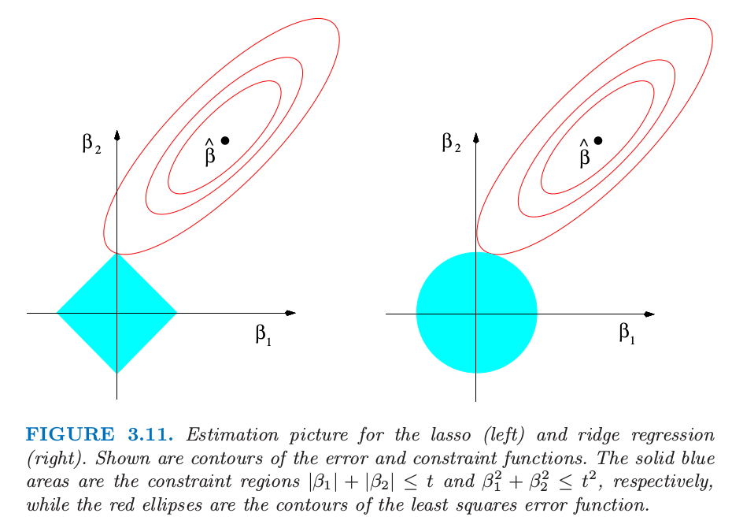

We can generalize ridge regression and the lasso, and view them as Bayes estimates. Consider the criterion
$$
\mathop{\beta}^\sim = \mathop{argmin}_{\beta} \Bigg \{ \sum_{i=1}^N(y_i - \beta_0 - \sum_{j=1}^p x_{ij}\beta_j)^2 + \lambda \sum_{j=1}^p |\beta_j|^q \Bigg \}
$$
for $$q \ge 0$$. The contours of constant value $$\sum_j |\beta_j|^q$$ are shown in Figure 3.12, for the case of two inputs.

Thinking of $$|\beta_j|^q$$ as the log-prior density for $$\beta_j$$, these are also the equi-contours of the prior distribution of the parameters. The value $$q = 0$$ corresponds to variable subset selection, as the penalty simply counts the number of nonzero parameters; $$q = 1$$ corresponds to the lasso, while $$q = 2$$ to ridge regression. Notice that for $$q \le 1$$, the prior is not uniform in direction, but concentrates more mass in the coordinate directions. The prior corresponding to the $$q = 1$$ case is an independent double exponential (or Laplace) distribution for each input, with density $$(1/2\tau)exp(−|\beta|)/\tau)$$ and $$\tau = 1/\lambda$$. The case $$q = 1$$(lasso) is the smallest $$q$$ such that the constraint region is convex; non-convex constraint regions make the optimization problem more difficult.

In this view, the lasso, ridge regression and best subset selection are Bayes estimates with different priors. Note, however, that they are derived as posterior modes, that is, maximizers of the posterior. It is more common to use the mean of the posterior as the Bayes estimate. Ridge regression is also the posterior mean, but the lasso and best subset selection are not.

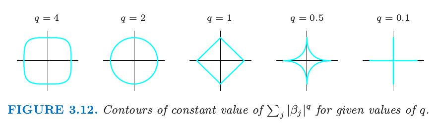

Looking again at the criterion (3.53), we might try using other values of $$q$$ besides 0, 1, or 2. Although one might consider estimating $$q$$ from the data, our experience is that it is not worth the effort for the extra variance incurred. Values of $$q \in (1, 2)$$ suggest a compromise between the lasso and ridge regression. Although this is the case, with $$q > 1$$, $$|\beta_j|^q$$ is differentiable at 0, and so does not share the ability of lasso $$(q = 1)$$ for setting coefficients exactly to zero. Partly for this reason as well as for computational tractability, Zou and Hastie (2005) introduced the elastic-net penalty
$$
\lambda \sum_{j=1}^p(\alpha \beta_j^2+(1-\alpha) |\beta_j|)
$$
a different compromise between ridge and lasso. Figure 3.13 compares the $$L_q$$ penalty with $$q = 1.2$$ and the elastic-net penalty with $$\alpha = 0.2$$; it is hard to detect the difference by eye. The elastic-net selects variables like the lasso, and shrinks together the coefficients of correlated predictors like ridge.

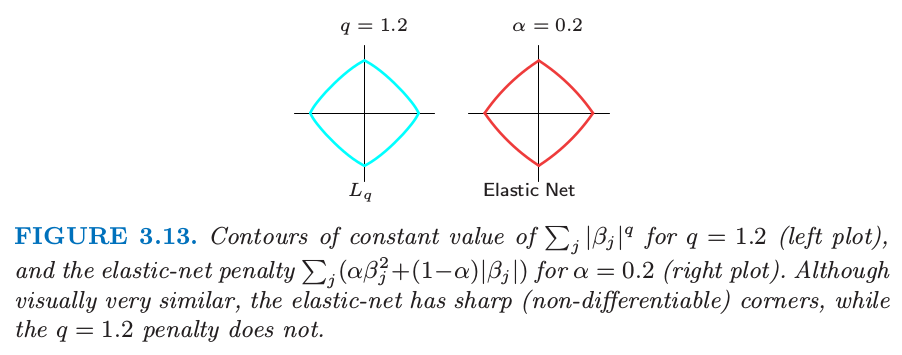

### Least Angle Regression

LAR is intimately connected with the lasso, and in fact provides an extremely efficient algorithm for computing the entire lasso path as in Figure 3.10.

Forward stepwise regression builds a model sequentially, adding one variable at a time. At each step, it identifies the best variable to include in the *active set*, and then updates the least squares fit to include all the active variables.

Least angle regression uses a similar strategy, but only enters "as much" of a predictor as it deserves. At the first step it identifies the variable most correlated with the response. Rather than fit this variable completely, LAR moves the coefficient of this variable continuously toward its least squares value (causing its correlation with the evolving residual to decrease in absolute value). As soon as another variable "catches up" in terms of correlation with the residual, the process is paused. The second variable then joins the active set, and their coefficients are moved together in a way that keeps their correlations tied and decreasing. This process is continued until all the variables are in the model, and ends at the full least-squares fit. Algorithm 3.2 provides the details. The termination condition in step 5 requires some explanation. If $$p > N − 1$$, the LAR algorithm reaches a zero residual solution after $$N − 1$$ steps (the $$−1$$ is because we have centered the data).

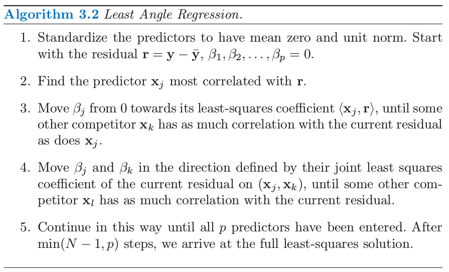

Suppose $$\mathcal{A}_k$$ is the active set of variables at the beginning of the $$k$$th step, and let $$\beta_{\mathcal{A}_k}$$ be the coefficient vector for these variables at this step; there will be $$k − 1$$ nonzero values, and the one just entered will be zero. If $$\mathbf{r}_k = \mathbf{y} − \mathbf{X}_{\mathcal{A}_k} \beta_{\mathcal{A}_k}$$ is the current residual, then the direction for this step is
$$
\delta_k=(\mathbf{X}^T_{\mathcal{A}_k}\mathbf{X}_{\mathcal{A}_k})^{-1} \mathbf{X}^T_{\mathcal{A}_k} \mathbf{r}_k.
$$
The coefficient profile then evolves as $$\beta_{\mathcal{A}_k}(\alpha) = \beta_{\mathcal{A}_k} + \alpha \cdot \delta_k$$. If the fit vector at the beginning of this step is $$\hat{\mathbf{f}}_k$$, then it evolves as $$\hat{\mathbf{f}}_k(\alpha) = \mathbf{f}_k + \alpha \cdot \mathbf{u}_k$$, where $$\mathbf{u}_k = \mathbf{X}_{\mathcal{A}_k} \delta_k$$ is the new fit direction. The name "least angle" arises from a geometrical interpretation of this process; $$\mathbf{u}_k$$ makes the smallest (and equal) angle with each of the predictors in $$\mathcal{A}_k$$ is the new fit direction. Figure 3.14 shows the absolute correlations decreasing and joining ranks with each step of the LAR algorithm, using simulated data.

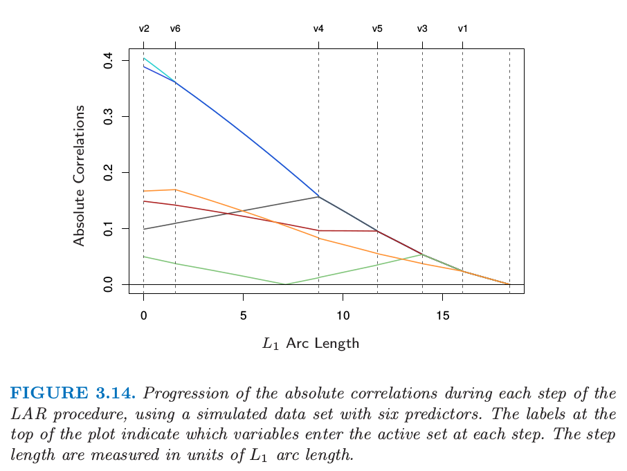

By construction the coefficients in LAR change in a piecewise linear fashion. Figure 3.15 [left panel] shows the LAR coefficient profile evolving as a function of their $$L_1$$ arc length [^2] . Note that we do not need to take small steps and recheck the correlations in step 3; using knowledge of the covariance of the predictors and the piecewise linearity of the algorithm, we can work out the exact step length at the beginning of each step.

The right panel of Figure 3.15 shows the lasso coefficient profiles on the same data. They are almost identical to those in the left panel, and differ for the first time when the blue coefficient passes back through zero. For the prostate data, the LAR coefficient profile turns out to be identical to the lasso profile in Figure 3.10, which never crosses zero. These observations ead to a simple modification of the LAR algorithm that gives the entire lasso path, which is also piecewise-linear.

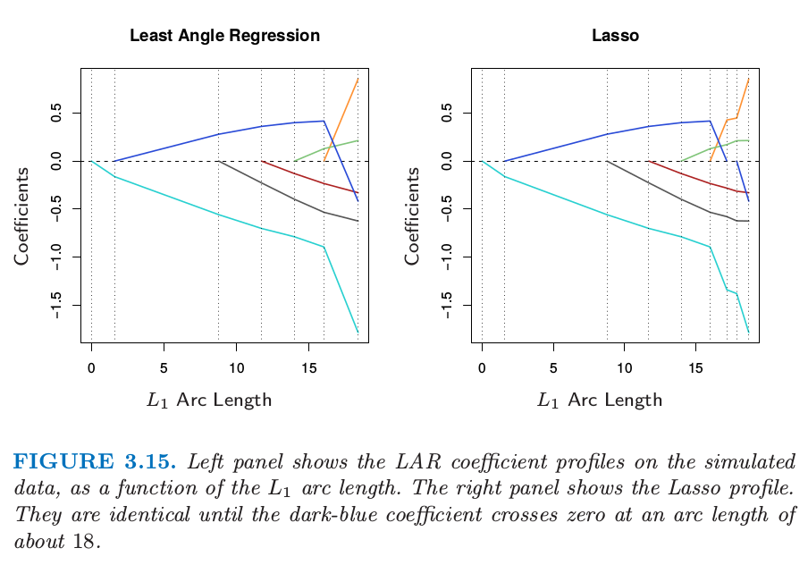

The algorithm can also been showed as below figure:

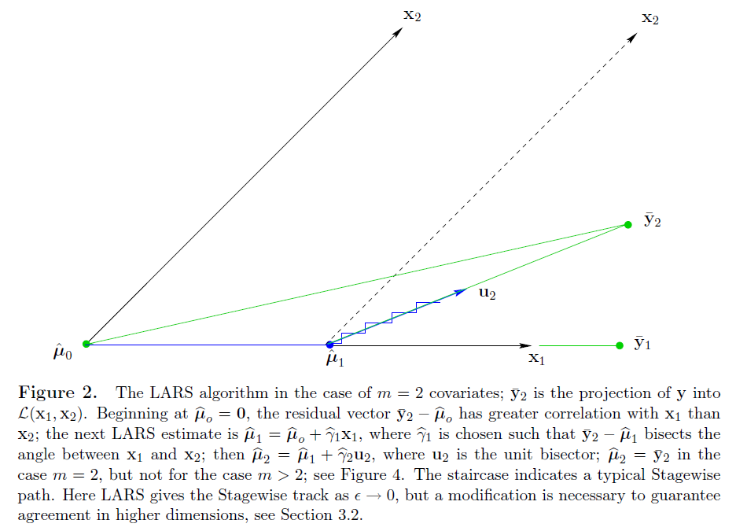

We now give a heuristic argument for why these procedures are so similar. Although the LAR algorithm is stated in terms of correlations, if the input features are standardized, it is equivalent and easier to work with inner-products. Suppose $$\mathcal{A}$$ is the active set of variables at some stage in the algorithm, tied in their absolute inner-product with the current residuals $$\mathbf{y} − \mathbf{X}\beta$$. We can express this as
$$
\mathbf{x}_j^T(\mathbf{y}-\mathbf{X}\beta)=\gamma \cdot s_j,\quad \forall j \in \mathcal{A} \qquad (3.56)
$$
where $$s_j \in \{−1, 1\}$$ indicates the sign of the inner-product, and $$\gamma$$ is the common value. Also $$|\mathbf{x}^T_k (\mathbf{y} − \mathbf{X}\beta)| \le \gamma \quad \forall k \in \mathcal{A}$$. Now consider the lasso criterion, which we write in vector form
$$
R(\beta) = \frac{1}{2} \|\mathbf{y}-\mathbf{X}\beta \|^2_2 + \lambda \|\beta\|_1
$$

Let $$\mathcal{B}$$ be the active set of variables in the solution for a given value of $$\lambda$$. For these variables $$R(\beta)$$ is differentiable, and the stationarity conditions give
$$
\mathbf{x}_j^T(\mathbf{y}-\mathbf{X}\beta)=\lambda \cdot sign(\beta_j), \quad \forall j \in \mathcal{B} \qquad (3.58)
$$
Comparing (3.58) and (3.56), we see that they are identical only if the sign of $$\beta_j$$ matches the sign of the inner product. That is why the LAR algorithm and lasso start to differ when an active coefficient passes through zero; condition(3.58) is violated for that variable, and it is kicked out of the active set $$\mathcal{B}$$. The stationarity conditions for the non-active variables require that
$$
|\mathcal{x}_k^T(\mathcal{y}-\mathcal{X}\beta)|\le \lambda, \quad \forall k \notin \mathcal{B},
$$
which again agrees with the LAR algorithm.

Figure 3.16 compares LAR and lasso to forward stepwise and stagewise regression.

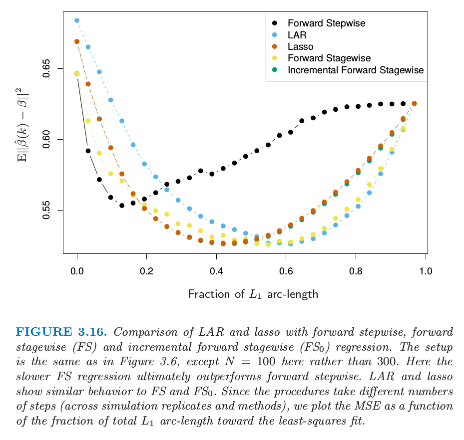

### Degrees-of-Freedom Formula for LAR and Lasso

Consider first a linear regression using a subset of $$k$$ features. If this subset is prespecified in advance without reference to the training data, then the degree of freedom used in the fitted model is defined to be $$k$$. In classical statistics, the number of linearly independent parameters is what is meant by "degree of freedom".

We define the degree of freedom of the fitted vector $$\hat{\mathbf{y}}=(\hat{y}_1,\hat{y}_2,\dots,\hat{y}_N)$$ as
$$
df(\hat{\mathbf{y}}) = \frac{1}{\sigma^2} \sum_{i=1}^N Cov(\hat{y}_i, y_i).
$$

Here $$Cov(\hat{y}_i, y_i)$$ refers to the sampling covariance between the predicted value $$\hat{y}_i$$ and its corresponding outcome value $$y_i$$. This makes intuitive sense: the harder that we fit to the data, the larger this covariance and hence $$df(\hat{\mathbf{y}})$$.

Now for a linear regression with $$k$$ fixed predictors, it is easy to show that $$df(\hat{\mathbf{y}})=k$$. Likewise for ridge regression, this definition leads to the closed-form expression: $$df(\hat{\mathbf{y}})=tr(\mathbf{S}_{\lambda})$$. In both these cases, $$Cov(\hat{y}_i, y_i)/\sigma^2$$ is simple to evaluate because the fit $$\hat{\mathbf{y}}=\mathbf{H}_{\lambda}\mathbf{y}$$ is linear in $$\mathbf{y}$$.

[^1]: Notice here. If we consider PCA as transforming a matrix into a different space, we can write it like $$AP=B$$ and $$B^TB=D$$, $$D$$ for a diagonal matrix. PCA is finding the eigenvectors of $$A^T A/N$$ as $$Q$$ which is $$P$$. And $$A^TA=VD^2V^T$$, $$V$$ just equals to $$Q$$.

[^2]: The $$L_1$$ arc-length of a differentiable curve $$\beta(s)$$ for $$s \in [0,S]$$ is given by $$TV(\beta,S)=\int_0^S \| \dot{\beta}(s) \| ds$$, where $$\dot{\beta}(s)=\partial{\beta(s)}/\partial{s}$$. For the piecewise-linear LAR coefficient profile, this amounts to summing the $$L_1$$ norms of the changes in coefficients from step to step.
