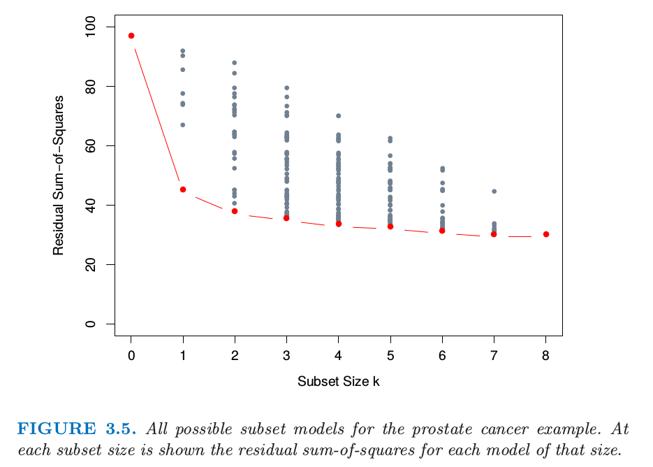
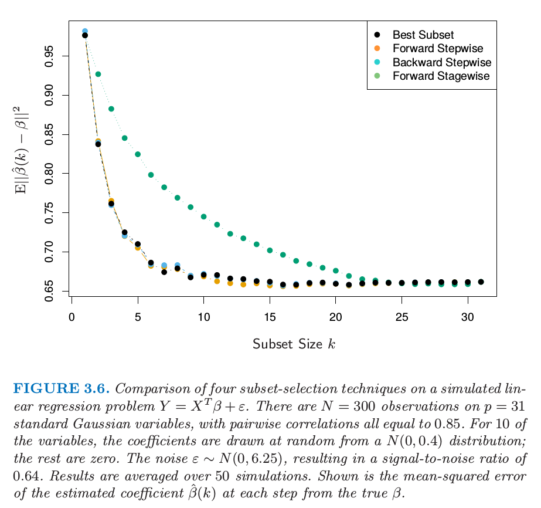

## Subset Selection

There are two reasons why we are not satisfied with the least squares estimates.
+ The first is *prediction accuracy*: the least squares estimates often have low bias but large variance. Prediction accuracy can sometimes be improved by shrinking or setting some coefficients to zero. By doing so we sacrifice a little bit of bias to reduce the variance of the predicted values, and hence may improve the overall prediction accuracy.
+ The second reason is *interpretation*. With a large number of predictors, we often would like to determine a smaller subset that exhibit the strongest effects. In order to get the "big picture", we are willing to sacrifice some of the small details.

### Best-Subset Selection

Best subset regression finds for each $$k \in \{0,1,2,\dots,p \}$$ the subset of $$k$$ gives smallest residual sum of squares. The *leaps and bounds* procedure makes this feasible for $$p$$ as large as 30 or 40. The figure showed below is the example for the prostate cancer. Note that the best subset of size 2, for example, need not include the variable that was in the best subset of size 1.

### Forward- and Backward-Stepwise Selection

Forward-stepwise selection starts with the intercept, and then sequentially adds into the model the predictor that most improves the fit.

Forward-stepwise selection is a *greedy algorithm*, producing a nested sequence of models. In this sense it might seem sub-optimal compared to best-subset selection. However, there are several reasons why it might be preferred:

+ *Computational*; for large $$p$$ we cannot compute the best subset sequence, but we can always compute the forward stepwise sequence (even when $$p \gg N$$ ).
+ *Statistical*; a price is paid in variance for selecting the best subset of each size; forward stepwise is a more constrained search, and will have lower variance, but perhaps more bias.

*Backward-stepwise* selection starts with the full model, and sequentially deletes the predictor that has the least impact on the fit. The candidate for dropping is the variable with the smallest Z-score. Backward selection can only be used when $$N > p$$, while forward stepwise can always be used.

Some software packages implement hybrid stepwise-selection strategies that consider both forward and backward moves at each step, and select the "best" of the two. For example in the R package the step function uses the AIC criterion for weighing the choices, which takes proper account of the number of parameters fit; at each step an add or drop will be performed that minimizes the AIC score.

Finally, we note that often variables come in groups (such as the dummy variables that code a multi-level categorical predictor). Smart stepwise procedures (such as step in R) will add or drop whole groups at a time, taking proper account of their degrees-of-freedom.

### Forward-Stagewise Regression

Forward-stagewise regression (FS) is even more constrained than forward-stepwise regression. It starts like forward-stepwise regression, with an intercept equal to $$\bar{y}$$, and centered predictors with coefficients initially all 0. At each step the algorithm identifies the variable most correlated with the current residual. It then computes the simple linear regression coefficient of the residual on this chosen variable, and then adds it to the current coefficient for that variable. This is continued till none of the variables have correlation with the residuals—i.e. the least-squares fit when $$N > p$$.

Unlike forward-stepwise regression, none of the other variables are adjusted when a term is added to the model. It will take a long time to catch up forward- or backward-steps regression.
