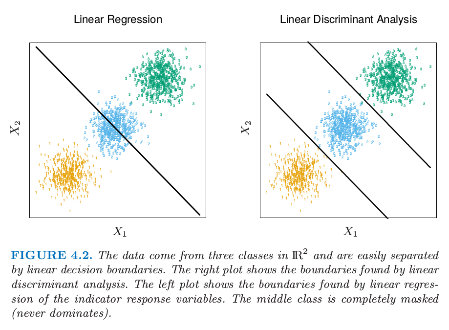

## Linear Regression of an Indicator Matrix

Here each of the response categories are coded via an indicator variable. Thus if $$\mathcal{G}$$ has $$K$$ classes, there will be $$K$$ such indicators $$Y_k$$, $$k = 1, \dots , K$$, with $$Y_k = 1$$ if $$G = k$$ else $$0$$. These are collected together in a vector $$Y = (Y_1 , \dots , Y_K )$$, and the $$N$$ training instances of these form an $$N \times K$$ indicator response matrix $$\mathbf{Y}$$. $$\mathbf{Y}$$ is a matrix of $$0$$'s and $$1$$'s, with each row having a single 1. We fit a linear regression model to each of the columns of $$\mathbf{Y}$$ simultaneously, and the fit is given by
$$
\hat{\mathbf{Y}}=\mathbf{X}(\mathbf{X}^T \mathbf{X})^{-1} \mathbf{X}^T \mathbf{Y}.
$$
Note that we have a coefficient vector for each response column $$\mathbf{y}_k$$, and hence a $$(p+1)\times K$$ coefficient matrix $$\hat{\mathbf{B}} = (\mathbf{X}^T \mathbf{X})^{−1} \mathbf{X}^T \mathbf{Y}$$. Here $$\mathbf{X}$$ is the model matrix with $$p+1$$ columns corresponding to the $$p$$ inputs, and a leading column of $$1$$'s for the intercept.

A new observation with input x is classified as follows:
+ compute the fitted output $$\hat{f}(x)=[(1,x)\hat{\mathbf{B}}]^T$$ a $$K$$ vector
+ identify the largest component and classify according:
$$
\hat{G}(x) = argmax_{k \in \mathcal{G}}\hat{f}_k(x).
$$

Why this approach works? One reason is to view the regression as an estimate of conditional expectation. The real issue is how good an approximation to conditional expectation is the rather rigid linear regression model?

One viewpoint is to construct *targets* $$t_k$$ for each class, where $$t_k$$ is the $$k$$th column of $$K \times K$$ identity matrix. Our prediction problem is to try and reproduce the  appropriate target for an observation. We might then fit the linear model by least squares:
$$
\mathop{min}_{\mathbf{B}} \sum_{i-1}^N \| y_i-[(1,x_i)\mathbf{B}]^T \|^2.
$$

The criterion is a sum-of-squared Euclidean distance of the fitted vectors from their targets. And a new observation can be classified by computing its fitted vector and classifying to the closest target:
$$
\hat{G(x)} = \mathop{argmin}_k \| \hat{f}(x)-t_k \|^2
$$

There is a serious problem with the regression approach when the number of classes $$K \ge 3$$, especially prevalent when $$K$$ is large. Because of the rigid nature of the regression model, classes can be masked by others. Figure 4.2 illustrates an extreme situation when $$K = 3$$. The three classes are perfectly separated by linear decision boundaries, yet linear regression misses the middle class completely.

